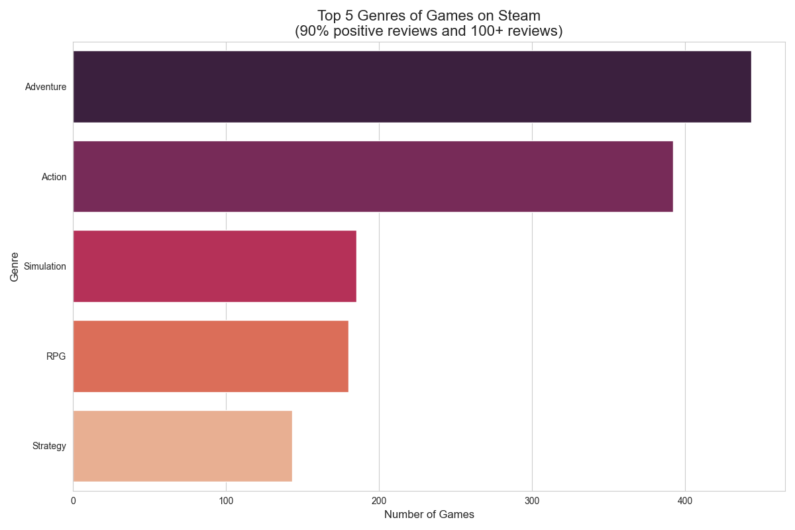
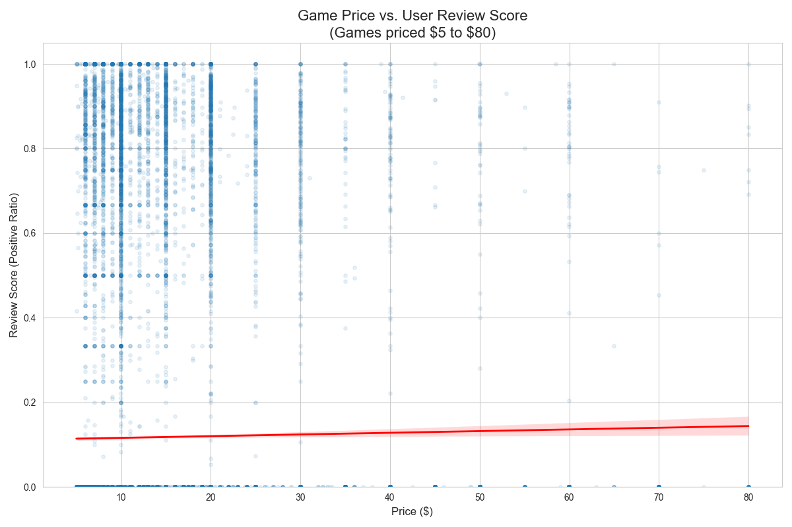
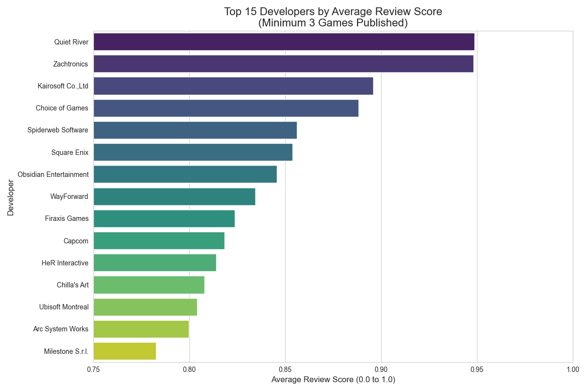

# Overview

In efforts to take my coding experience to be more applicable and useful, I decided to dive into a data analysis project. My primary goal was to work with a large, real-world dataset,  and apply fundamental  data science techniques to get some  kind of meaningful insights. Well, as a long-time PC gamer, I felt that analyzing data from the most popular game distribution system on the planet, Steam Games, would be a great way to showcase my ability to analyze and extract meaning from a large data set. I would also demonstrate a solid ability to clean semi-formatted data to an analaysis ready form, use statistical analysis, and demonstrate it visually with rendered graphs.

The dataset used is the "All Steam Games" dataset found [here on Kaggle](https://www.kaggle.com/datasets/joebeachcapital/top-1000-steam-games?resource=download&select=93182_steam_games.csv). This dataset contained information on over 90,000 games on Steam, including 39 columns of individual data points on each game, including the cost, user reviews, ratings, name, developer name, title, release date, and so on. The data focused on was the review data, the cost, and the ratings.

The data was cleaned of games that had incomplete critical data, or of adult content games.

The main purpose of the software is to answer specific, data-driven questions about trends in the video game market using the Pandas library for data manipulation.

[Software Demo Video](http://youtube.link.goes.here)

# Data Analysis Results

**QUESTION 1:** What are the 5 most common genres among top-rated games?

Games analyzed based on the following criteria:
* 90% Positive Reviews
* 100 Total Reviews

*Result*

    Genre       # Games
    --------------------
    Adventure     443
    Action        392
    Simulation    185
    RPG           180
    Strategy      143

 

 **QUESTION 2:** Is there a correlation between game price and the review score?"

 The [Pearson Correlation Coefficient](https://www.statology.org/pearson-correlation-coefficient/) score between Price and Review Score is: **0.0127**

 The correlation coefficient score of 0.0127 is extremely close to zero, indicating no meaningful linear relationship between Price and Review Score. The variables appear to be independent.

 

 **QUESTION 3:** What are the top 15 developers which have the best track record for releasing top rated games?

Developers analyzed based on the following criteria:
* Developer has at least 3 published games.
* 100 Total Reviews

*Result*

    Quiet River (Avg Score: 94.86%)
    Top Games:
        1. Zup! S
        2. qop 4
        3. Zup! 9

    Zachtronics (Avg Score: 94.81%)
    Top Games:
        1. TIS-100
        2. SHENZHEN I/O
        3. NERTS! Online

    Kairosoft Co.,Ltd (Avg Score: 89.59%)
    Top Games:
        1. Mega Mall Story
        2. Convenience Stories
        3. Forest Camp Story

    Choice of Games (Avg Score: 88.83%)
    Top Games:
        1. Vampire: The Masquerade — Parliament of Knives
        2. Vampire: The Masquerade — Night Road
        3. Choice of Rebels: Uprising

    Spiderweb Software (Avg Score: 85.62%)
    Top Games:
        1. Avernum: Escape From the Pit
        2. Avadon 3: The Warborn
        3. Avernum 4

    Square Enix (Avg Score: 85.38%)
    Top Games:
        1. FINAL FANTASY VII
        2. KINGDOM HEARTS III + Re Mind (DLC)
        3. FINAL FANTASY IV

    Obsidian Entertainment (Avg Score: 84.57%)
    Top Games:
        1. South Park™: The Stick of Truth™
        2. Fallout: New Vegas
        3. Pillars of Eternity

    WayForward (Avg Score: 83.46%)
    Top Games:
        1. Shantae and the Pirate's Curse
        2. Mighty Switch Force! Hyper Drive Edition
        3. Contra: Operation Galuga

    Firaxis Games (Avg Score: 82.37%)
    Top Games:
        1. Civilization IV: Beyond the Sword
        2. Sid Meier's Civilization® IV
        3. Civilization IV®: Warlords

    capcom (Avg Score: 81.84%)
    Top Games:
        1. Resident Evil 4 (2005)
        2. Dragon's Dogma: Dark Arisen
        3. DEAD RISING®

    HeR Interactive (Avg Score: 81.40%)
    Top Games:
        1. Nancy Drew®: Secret of the Old Clock
        2. Nancy Drew®: Secret of the Scarlet Hand
        3. Nancy Drew®: The Captive Curse

    Chilla's Art (Avg Score: 80.79%)
    Top Games:
        1. [Chilla's Art] The Closing Shift | 閉店事件
        2. [Chilla's Art] The Caregiver | 終焉介護
        3. [Chilla's Art] Stigmatized Property | 事故物件

    Ubisoft Montreal (Avg Score: 80.41%)
    Top Games:
        1. Tom Clancy's Rainbow Six® Vegas 2
        2. Tom Clancy's Rainbow Six® Siege
        3. Tom Clancy's Rainbow Six® Siege

    Arc System Works (Avg Score: 79.98%)
    Top Games:
        1. GUILTY GEAR Xrd -SIGN-
        2. Guilty Gear X2 #Reload
        3. BlazBlue: Cross Tag Battle
    Milestone S.r.l. (Avg Score: 78.27%)
    Top Games:
        1. MotoGP™19
        2. Monster Energy Supercross - The Official Videogame
        3. MXGP 2021 - The Official Motocross Videogame

 

# Development Environment

{Describe the tools that you used to develop the software}

{Describe the programming language that you used and any libraries.}

# Useful Websites

{Make a list of websites that you found helpful in this project}
* [Web Site Name](http://url.link.goes.here)
* [Web Site Name](http://url.link.goes.here)

# Future Work

{Make a list of things that you need to fix, improve, and add in the future.}
* Item 1
* Item 2
* Item 3